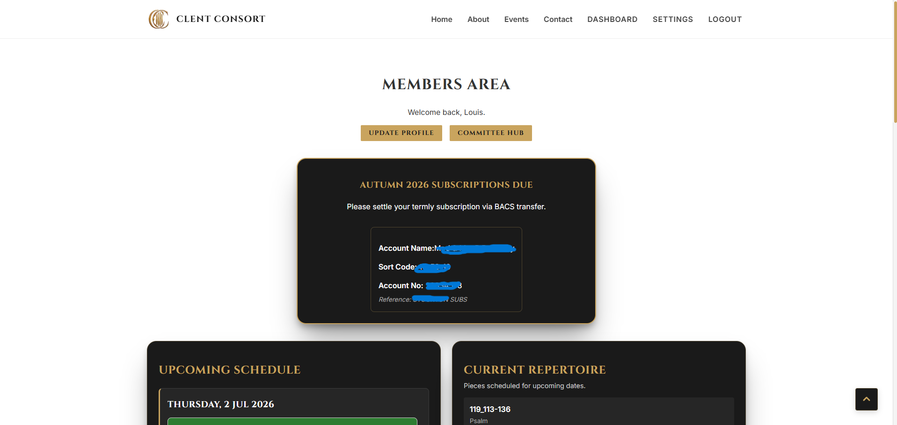

# 🏛️ The Clent Consort | Full-Stack Web Application

[](https://github.com/StockoL/clent-consort-site)
[](#testing)
[](#testing)

**[🔴 LIVE APPLICATION: Click here to view the deployed application on Render (Staging)](www.clentconsort.org)**

The Clent Consort is a bespoke, full-stack web application developed for an amateur choral ensemble based in the Clent Hills, Worcestershire.

Moving beyond a simple static brochure, the application is engineered as a dual-purpose digital ecosystem. It provides a high-visibility "Electronic Press Kit" (EPK) to secure prestigious ecclesiastical residencies, while simultaneously serving as a secure, database-driven logistics hub for the active members of the choir. Built on a Python/Django backend with a bespoke, utility-first CSS architecture, the development prioritises clean, DRY (Don't Repeat Yourself) code principles and high-performance accessibility.

---

## <a name="top"></a>📋 Table of Contents

1. [📖 Project Purpose & User Stories](#purpose)
2. [🔬 Strategic Research & UX Design (The 5 Planes)](#ux-strategy)
3. [🖼️ Phase 1: Frontend Architecture & CSS Primitives](#frontend-architecture)
4. [⚙️ Phase 2: Backend Production (Django Integration)](#backend-architecture)
5. [✨ Core Features & Page Implementations](#features)
6. [🏗️ Development Log & Engineering Phases](#dev-log)
7. [🧪 Testing & Quality Assurance Portfolio](#testing)
8. [🌐 Deployment Guide](#deployment)
9. [🤖 Architectural Collaboration with AI](#ai-collab)

---

## 1. <a name="purpose"></a> 📖 Project Purpose & User Stories

The objective is to architect a high-performance web application that serves as both a public-facing promotional tool and a functional resource hub. The core user requirements have been mapped using Behavior-Driven Development (BDD) acceptance criteria to ensure technical implementations directly serve user goals.

### 1. The Ecclesiastical Stakeholder (Cathedral Deans)

_Focus: Professionalism, musical excellence, and reliability._

- **User Story:** As a Cathedral Dean, I want to review the ensemble's digital portfolio and track record so that I can verify they are a "safe pair of hands" to cover a weekend residency.
  - **BDD Acceptance Criterion:** **Given** a Cathedral Dean is evaluating ensembles for a weekend residency, **When** they navigate to the 'About' and 'Events' pages, **Then** they are presented with a professional digital EPK and a track record demonstrating musical excellence.

### 2. The Patron & Prospective Member

_Focus: Access, repertoire, and logistics._

- **User Story:** As a local resident, I want access to a performance calendar so I can purchase tickets to upcoming local events.
  - **BDD Acceptance Criterion:** **Given** a local resident is seeking live choral music, **When** they visit the 'Events' page, **Then** they see a chronological calendar of upcoming performances with clear geographical and booking details.
- **User Story:** As a prospective singer, I want to see the current repertoire to assess the musical alignment and commitment level of the choir before auditioning.
  - **BDD Acceptance Criterion:** **Given** a prospective singer is considering joining the ensemble, **When** they review the public repertoire and event history, **Then** they can accurately assess the ensemble's musical alignment before submitting an audition request via the dual-stream Contact form.

### 3. The Active Chorister

_Focus: Utility, sheet music access, and scheduling._

- **User Story:** As a current member, I want a centralised resource area to retrieve sheet music PDFs, practice tracks, and rehearsal schedules efficiently on a mobile device.
  - **BDD Acceptance Criterion:** **Given** an active chorister requires logistics for an upcoming rehearsal, **When** they log securely into the Member Dashboard on a mobile device, **Then** they can access their specific voice part's schedule and execute "Clickable Row" document retrieval with zero layout overflow.

## <p align="right">(<a href="#top">Back to top</a>)</p>

## 2. <a name="ux-strategy"></a> 🔬 Strategic Research & UX Design (The 5 Planes)

### Strategic Research

To ensure the site meets real-world needs, a product audit of local ensemble websites was conducted. Findings showed that most provided concert dates and an engaging EPK experience. However, practically none boasted an effective "members' area" for resource sharing, opting instead for fragmented email chains. The Clent Consort application bridges this gap by unifying public promotion and internal logistics.

### I. Strategy & Scope

- **Phase 1 (Frontend MVP):** Build a responsive, highly accessible static site using semantic HTML and a bespoke CSS architecture.
- **Phase 2 (Backend Production):** Transition the static prototype into a dynamic web application using Python/Django, introducing secure user authentication, a PostgreSQL database, and cloud AWS media storage.

### II. Structure & Skeleton

- **The Patron's Path:** Home > Events > Venue Map/Details > Contact.
- **The Stakeholder's Path:** Home > About (Credentials) > Events (Track Record) > Contact (Booking).
- **Resilient UX (404 Strategy):** A custom 404 page is implemented with a prominent "Return to Home" button to prevent navigational dead-ends.

### III. Surface (Typography & Aesthetics)

The visual surface enforces a **"Cathedral Aesthetic"**—utilising deep charcoal (`#1a1a1a`), stone neutrals, and gold accents (`#c9a45e`).

- **Display Typography (Cinzel):** Selected for classical Roman proportions evoking the timeless nature of choral music. Uppercase styling and increased tracking evoke luxury and historical weight.
- **Body Typography (Inter):** A high-performance sans-serif with an exceptional x-height for digital clarity. Ensures that logistical data (dates/times/venues) remains instantly digestible on mobile screens.

## <p align="right">(<a href="#top">Back to top</a>)</p>

## 3. <a name="frontend-architecture"></a> 🖼️ Phase 1: Frontend Architecture & CSS Primitives

My approach to the frontend UI avoids bloated frameworks like Bootstrap. Instead, it relies on a bespoke, utility-first CSS architecture heavily influenced by the **Every Layout** methodology (Heydon Pickering & Andy Bell).

### Axiomatic Layout Primitives

Instead of relying on rigid, breakpoint-heavy media queries, the site uses intrinsic layouts that leverage the browser's native engine computing constraints algorithmically.

- **The Stack (`.l-stack > * + *`):** Utilises the "Lobotomised Owl" (adjacent sibling selector) to inject vertical rhythm strictly _between_ elements. This provides a single source of truth for spacing, mathematically tied to a CSS Custom Property scale (`--s-1` to `--s5`).
- **The Switcher (`.l-switcher`):** A container-based logic gate (`flex-basis: calc((var(--threshold) - 100%) * 999);`). If the container is narrower than the defined threshold (e.g., 40rem), the calculation evaluates to a massive integer, forcing elements to grow and wrap automatically.
- **The Sidebar (`.l-sidebar`):** Uses a high flex-grow hack (`flex-grow: 999`) on the content column, allowing complex asymmetrical layouts (like the Conductor's bio) to manage themselves fluidly.
- **The Reel (`.l-reel`):** Provides a smooth, horizontal scrolling experience using native CSS Flexbox and Scroll Snapping (`scroll-snap-type: x mandatory`), bypassing heavy JavaScript carousels that damage performance scores.
- **The Unified Invert (`.box.invert`):** A modular card primitive enforcing the dark-mode aesthetic. This DRY approach means any layout can become a high-contrast container simply by stacking these two classes.

## <p align="right">(<a href="#top">Back to top</a>)</p>

## 4. <a name="backend-architecture"></a> ⚙️ Phase 2: Backend Production (Django Integration)

Transitioning the prototype to a full-stack environment required engineering a robust backend infrastructure with a strict "Security by Design" mindset. The system was rebuilt utilizing **Python** and the **Django 5.0** framework, prioritising the protection of user data, proprietary ensemble assets, and scalable code maintainability.

### Django Architecture & Template Inheritance

The static Phase 1 HTML files were completely deconstructed into a modular Django template system to enforce DRY (Don't Repeat Yourself) architecture.

- **The Master Skeleton (`base.html`):** The global `<head>`, persistent sticky navigation, and footer grid were extracted into a single master template.
- **Dynamic Context Rendering:** Individual pages (e.g., `events.html`) were refactored to use `` and ``.

<details>
<summary><b>🔍 Expand Engineering Case Study: Mitigating Technical Debt</b></summary>

#### The Template Inheritance Strategy

In the static prototype, a single change to the main navigation required manual updates across eight separate HTML files—a highly error-prone process. By migrating to Django's template engine, the architecture now relies on inheritance.

The `base.html` file acts as the single source of truth for the site's structural wrapper. Child templates only inject their specific, unique content into predefined blocks. This architectural decision eliminates code duplication, significantly reduces the repository footprint, and ensures that layout adjustments instantly and safely cascade across the entire application simultaneously.

</details>

### The Authentication Perimeter (Django-Allauth)

The "Member Resource Area" required a secure gateway to protect copyrighted sheet music and internal logistics. I implemented the `django-allauth` package to manage cryptographic hashing and user sessions.

- **Zero-Trust Public Registration:** Because this is a private ensemble, open public signup forms represent an unnecessary vector for bot spam. I integrated `django-invitations` and configured `INVITATIONS_INVITE_ONLY = True`.
- **Bespoke UI Overrides:** Default third-party package templates visually break bespoke frontend design systems. I engineered a complete override by mapping Allauth's backend hooks directly into my custom HTML structures.

<details>
<summary><b>🔍 Expand Engineering Case Study: Secure UI Integration</b></summary>

#### Overriding Third-Party Authentication UX

The default `django-allauth` package provides robust cryptographic security but injects unstyled, table-based HTML forms that shattered the project's intrinsic CSS primitives.

Instead of writing brittle, high-specificity CSS to patch Allauth's default forms, I intercepted the template rendering hierarchy. I recreated the exact expected directory structure (`templates/account/login.html`) and mapped the required Python backend variables (e.g., swapping `username` fields for `type="email"` inputs) directly into my custom `.box .invert` markup.

This ensured the entire password-reset and login journey remained visually consistent with the main application, maintaining frontend continuity without compromising backend security.

</details>

### Cloud Storage (AWS S3) & Static File Delivery

A choral ensemble generates massive files (PDF scores, MP3 rehearsal tracks). Storing these directly on the web server would cause severe database bloat, limit scalability, and degrade performance.

- **Amazon Web Services (S3):** I configured the `boto3` and `django-storages` packages to offload all user-uploaded media to an AWS S3 bucket, keeping the core server incredibly lean.
- **Static File Interception:** Django explicitly drops static asset (CSS/JS) serving in production environments. I implemented `WhiteNoise` middleware to handle this delivery pipeline.

<details>
<summary><b>🔍 Expand Engineering Case Study: The WSGI Delivery Pipeline</b></summary>

#### Separating Media and Static Lifecycles

User-uploaded media (sheet music) and developer-written static files (CSS) have entirely different lifecycles and security requirements.

When a director uploads a new PDF via the secure Django Admin panel, the `storages` backend automatically routes that file to AWS S3. However, routing static CSS files to S3 introduces unnecessary network latency for core stylistic elements.

To solve this, `WhiteNoise` was injected directly into the `MIDDLEWARE` array immediately after the Security Middleware. This intercepts static file requests, applies aggressive Brotli/Gzip compression, and serves the bespoke CSS/JS efficiently and securely directly from the Python WSGI server (Gunicorn) before the request ever hits the database layer.

</details>

### Python Configuration & Environmental Security

The `settings.py` file was entirely refactored to safely handle the transition from a local development laptop to the live internet, adhering to 12-Factor App methodology.

- **Environment Isolation (`.env`):** Integrated the `python-dotenv` package to isolate AWS IAM keys, the Django `SECRET_KEY`, and database credentials.
- **Database Abstraction:** Utilised `dj-database-url` to dynamically map Django's ORM between local SQLite files and high-performance production PostgreSQL databases.
- **Security Hardening:** Implemented strict, environment-aware logic (`if not DEBUG:`) to elevate the application's defensive posture automatically upon deployment.

<details>
<summary><b>🔍 Expand Engineering Case Study: Dynamic Security Routing</b></summary>

#### Defensive Transport & Session Protocols

Hardcoding sensitive data or security states is a critical vulnerability. The application relies on environmental polling to determine its context.

When deployed to production (where `DEBUG` evaluates to `False`), the configuration file automatically activates high-level anti-sniffing protocols. Both `SESSION_COOKIE_SECURE = True` and `CSRF_COOKIE_SECURE = True` are enforced, ensuring session IDs and CSRF tokens are only ever transmitted over encrypted HTTPS connections. Furthermore, the `ALLOWED_HOSTS` array strictly validates incoming traffic against designated production URLs, neutralising HTTP Host Header spoofing attacks.

</details>

<p align="right">(<a href="#top">Back to top</a>)</p>

## 5. <a name="features"></a> ✨ Core Features & The Private Members Area

Because the core utility of this application sits behind a secure authentication wall, this section serves as an architectural tour of the private Member Dashboard and Committee Hub, detailing how backend logic actively solves real-world organizational bottlenecks.

### 1. The Public Entrypoint & Native CSS Scrollytelling

_(Accessible via the public-facing URL)_

- **Critical Rendering Path:** Features a high-performance Hero Section utilizing fluid typography (`clamp()`) and `<link rel="preload">` to ensure near-instant Largest Contentful Paint (LCP) times.
- **Progressive Scrollytelling:** Employs experimental pure CSS "Scrollytelling" using the `view-timeline` API. As users swipe horizontally, background videos provide atmospheric context while text performs scroll-driven animations—entirely bypassing heavy JS scroll-hijacking libraries.

### 2. Dual-Stream Contact Gateways

Utilises the `.l-switcher` primitive (`--threshold: 60rem`). Booking and Audition forms sit side-by-side on wide screens but mathematically stack on mobile devices.

<details>
<summary><b>🔍 Expand Engineering Case Study: Zero-Friction Security UX</b></summary>

#### The Custom Honeypot Protocol

Securing public-facing forms (like the Audition and Booking endpoints) against automated spam bots usually involves implementing a CAPTCHA. However, CAPTCHAs introduce significant cognitive friction, degrade the aesthetic experience, and can cause severe accessibility hurdles for users with screen readers.

Instead of relying on a third-party CAPTCHA, I engineered a bespoke "Honeypot" field directly within `forms.py`. A visually hidden input field (labeled `website`) is injected into the form markup. Legitimate human users cannot see or tab into this field, leaving it blank. Automated bots, however, scan the raw HTML and reflexively populate it.

Before the backend processes the submission or fires an email via SMTP, Django runs a custom `clean_website` validation check. If _any_ data is detected in that field, the system instantly intercepts the request, raising a `ValidationError` and silently dropping the spam payload without impacting the experience of genuine users.

</details>

### 3. The Ergonomic Dashboard & Progressive Disclosure

(choir\static\documentation\members_dashboard_rsvp_matrix.png)

The primary member dashboard is engineered as a high-density logistics hub. To prevent visual clutter, the UI strictly adheres to **Progressive Disclosure**, meaning users only see actionable information exactly when they need it.

- **Fitts's Law in Action:** A chorister accessing the dashboard is likely standing in a rehearsal room, holding a physical folder, and trying to download a PDF on a small mobile screen with one hand. I transformed the entire `.music-row-link` into a massive 48px-tall flexbox touch target, eliminating "fat-finger" errors.
- **Conditional Subscription UI:** Rather than cluttering the screen with permanent financial boxes, the dashboard queries the `SubscriptionPayment` database. If a user owes termly fees, a high-contrast BACS instruction card appears. The exact moment an administrator logs their payment, the card vanishes, replaced by a subtle green "Paid" badge in the header.

### 4. The Auto-Healing RSVP Matrix

Logistics management typically relies on static spreadsheets. I engineered an auto-healing matrix within the `dashboard_view`.

When the page loads, the backend queries all upcoming events. If it detects a missing `Attendance` record for the logged-in user, it executes an instantaneous `bulk_create` SQL query to generate a "PENDING" row. This guarantees the dashboard never falls out of sync when administrators add new rehearsal dates mid-season.

<details>
<summary><b>🔍 Expand Engineering Case Study: Event-Driven Automation</b></summary>

#### Decoupling Logic with Django Signals

Handling complex logistical triggers within standard view functions often leads to bloated, fragile code ("Fat Views"). To ensure the database remains fully synchronised without tightly coupling the code, I implemented an Event-Driven Architecture utilising Django's Signal dispatcher.

By writing isolated observer functions in `signals.py` decorated with `@receiver(post_save)`, the application listens for state changes asynchronously. For example, when a new `Event` is created in the database, the `auto_add_existing_users_to_new_event` signal intercepts the save confirmation. It then queries all active singers and executes a highly performant `bulk_create` SQL query to instantly generate their 'PENDING' RSVP rows. This architectural Separation of Concerns ensures that creating a concert and generating its logistical scaffolding operate independently but flawlessly in tandem.

</details>

### 5. The Committee Hub & Financial Ledger


The Committee Hub replaces disparate Excel sheets with a centralised, secure command center. A key architectural decision was made regarding payment processing:

- **Zero-Fee Infrastructure:** Instead of integrating the Stripe API (which sacrifices 1.5% of choir funds to processing fees), the application acts as a manual BACS ledger. This architectural tradeoff intentionally prioritises the organization's financial health over flashy tech integrations.
- **Separation of Concerns:** The database normalises user data by separating `is_under_18` (a strict Safeguarding flag) from `is_exempt_from_subs` (a Financial business logic flag). This allows the committee to grant a low-income adult a financial bursary without corrupting child-protection protocols.
- **Compliance Tracking:** The ledger seamlessly integrates with the `GiftAidDeclaration` model, providing admins with an instant visual queue of whose payments are eligible for the 25% HMRC tax top-up.

### 6. Interactive RSVP Tracking (Vanilla JS)


To prevent the administrative RSVP report from becoming an endlessly scrolling, unreadable list, the view was refactored using an external Vanilla JavaScript tab switcher.

- **DOM Manipulation:** The script toggles display states (`'attending'`, `'absent'`, `'pending'`) locally in the browser, keeping data access instantaneous without requiring heavy page reloads.
- **Automated Communication Protocol:** The backend concatenates the emails of all "PENDING" users into a single string. The frontend utilises a semantic HTML `mailto:?bcc=...` link to generate a pre-formatted email in the admin's default client, securely hiding member addresses while allowing instant follow-ups.

### 7. The Command Center (Django Admin)

Leveraged and heavily customised Django's built-in Admin panel for the ensemble director, providing a secure GUI to perform CRUD operations on chorister profiles and event dates.

<details>
<summary><b>🔍 Expand Engineering Case Study: Immutable State & Internal Tooling</b></summary>

#### Engineering Fail-Safe Administration

A common pitfall in internal tooling is allowing administrative users to accidentally overwrite or resend historical data. To mitigate this risk within the `ChoirCommunication` broadcast system, I engineered strict, state-dependent mutability rules.

By overriding the `get_readonly_fields` method in `admin.py`, the application dynamically assesses the object's lifecycle state. When an administrator drafts a new email, all fields are open. However, the millisecond the broadcast is saved and dispatched to the ensemble via the Brevo SMTP relay, the backend locks the `subject`, `message`, `audience`, and `author` fields. This guarantees that sent communications become immutable historical records, completely neutralizing the risk of accidental modification or duplicate mass emails.

</details>

<p align="right">(<a href="#top">Back to top</a>)</p>

## 6. <a name="dev-log"></a> 🏗️ Development Log & Engineering Phases

To ensure a clean, maintainable, and scalable codebase, this application was built iteratively, resolving systemic layout and backend routing challenges at the architectural level rather than relying on brittle patches.

### Phase 1: Frontend Technical Log

- **Mobile Viewport Overflow:** During iPhone SE testing, the layout broke horizontally, creating a "nested pressure cooker" effect that disabled vertical scrolling. _Fix:_ Refactored the global `<body>` to `min-height: 100vh` and applied `max-width: 100%` safety valves to all intrinsic child primitives.
- **The Sticky Footer Anchoring:** On sparse pages (like the 404 error state), the footer floated awkwardly in the middle of the screen. _Fix:_ Engineered a flexbox global layout, applying `flex: 1` to the `<main>` element to act as a "greedy" container.
- **Logo Aspect Ratio Distortion:** Identified that flexbox expansions were horizontally stretching the logo on the member dashboard. _Fix:_ Refactored the raw asset to a perfect 1:1 canvas size in GIMP and enforced strict `width/height` HTML attributes.

<details>
<summary><b>🔍 Expand Engineering Case Study: Resolving Viewport "Pressure Cookers"</b></summary>

#### The `100vh` Flexbox Trap

During initial mobile testing, the application exhibited a critical "vertical lock" where users could not scroll, accompanied by horizontal bleeding of UI elements. Using Chrome Developer Tools, I profiled the rendering tree and identified a conflict between the global wrapper and the CSS `min()` primitives.

By setting the global `<body>` to a strict `height: 100vh`, I had accidentally created a rigid container. When the internal `l-switcher` primitives required more height to stack their contents on narrow screens, they collided with the rigid `100vh` floor. The flex-engine panicked, forcing the content to overflow horizontally instead.

**The Fix:** I refactored the global architecture to use `min-height: 100vh`. This allows the application to guarantee a full-screen presentation on sparse pages (perfectly pinning the footer via `flex: 1`), but allows the `<body>` to dynamically expand downwards to accommodate the intrinsic height requirements of dense, stacked mobile content, completely eliminating the horizontal overflow and restoring native scrolling.

</details>

### Phase 2: Backend Technical Log

- **Dynamic Email Routing:** A hardcoded `EMAIL_BACKEND` broke the application flow. If pushed to production, emails would silently print to the server log. _Fix:_ Refactored `settings.py` to intelligently poll the `DEBUG` state, fetching secure SMTP credentials dynamically only when in production.
- **Allauth Security Feedback Loop:** The default Allauth login form lacked interactive user feedback. _Fix:_ Engineered a state-driven CSS border system using `:placeholder-shown`, `:valid`, and `:invalid` pseudo-classes to handle validation natively.
- **ModuleNotFoundError during Deployment:** Python crashed when parsing the production `settings.py` on Render. _Fix:_ Synchronised the production virtual environment using `pip freeze > requirements.txt` to ensure cloud servers had access to the `dj-database-url` and `whitenoise` middleware packages.

<details>
<summary><b>🔍 Expand Engineering Case Study: Environment-Aware Infrastructure</b></summary>

#### Preventing Silent Failures in Production

When integrating `django-invitations`, the system relies heavily on email delivery to provision user accounts. During local development, configuring Django to use an SMTP server is dangerous and slows down testing. However, leaving the development `console.EmailBackend` active in production results in a catastrophic silent failure—users request an invite, the server prints the token to a hidden backend log, and the user assumes the application is broken.

**The Fix:** I engineered an environment-aware routing switch in `settings.py`.
When `DEBUG = True`, the system utilises the `console` backend, allowing me to instantly click invitation tokens directly in my VS Code terminal. When `DEBUG = False`, the system automatically shifts to the `.smtp.EmailBackend` and queries the OS environment variables for the injected `EMAIL_HOST_USER` and `EMAIL_HOST_PASSWORD`. This ensures seamless parity between environments without ever exposing the ensemble's proprietary Gmail App Passwords to version control.

</details>

<details>
<summary><b>🔍 Expand Engineering Case Study: JavaScript-Free Validation</b></summary>

#### State-Driven UI with CSS Pseudo-Classes

Standard form validation relies heavily on attaching JavaScript event listeners (`keyup`, `blur`) to input fields to toggle error classes. This adds unnecessary weight to the DOM and can cause execution delays.

To maintain a pristine Lighthouse Performance score while enhancing the security UX of the login page, I offloaded the validation logic entirely to the CSS rendering engine. By chaining high-specificity pseudo-classes (`input:not(:placeholder-shown):invalid`), the application suppresses default browser errors on empty fields. The moment a user types an invalid character format, the CSS engine instantly transitions the border to a pulsing crimson state. Once the HTML5 constraint API (`pattern` or `type="email"`) is satisfied, it locks to a green success state, providing instantaneous, haptic-like visual feedback with zero JavaScript overhead.

</details>

<p align="right">(<a href="#top">Back to top</a>)</p>

## 7. <a name="testing"></a> 🧪 Testing & Quality Assurance Portfolio

### Lighthouse Performance Audits

Performance optimisation was targeted directly through structural CSS changes and pre-loading critical path assets.

| Page    | Performance | Accessibility | Best Practices | SEO |
| :------ | :---------- | :------------ | :------------- | :-- |
| Index   | 98          | 100           | 100            | 100 |
| About   | 89          | 95            | 77\*           | 100 |
| Events  | 99          | 95            | 100            | 100 |
| Contact | 99          | 96            | 100            | 100 |
| Members | 100         | 95            | 100            | 100 |

_\* Best Practices scores on the About and Members pages reflect the intentional inclusion of Spotify and YouTube iframes. I chose to prioritise the User Experience (providing choral context via audio) over a synthetic 100 score, mitigating impact via `loading="lazy"`._

### W3C Validation

- **HTML:** All markup validated against HTML5 standards. Flagged `<time>` elements were resolved by implementing the `datetime` attribute (ISO 8601 standard) for SEO/Accessibility.
- **CSS Jigsaw:** Parse errors regarding `view-timeline` and `animation-timeline` are documented as intentional architectural decisions belonging to the emerging CSS Animation Level 4 specification. They provide high-end progressive enhancement (scrollytelling) while gracefully degrading in legacy browsers.

### Manual Verification Matrix

- **Security Perimeter Check:** Attempted to force-navigate to `/members/` directly via the URL bar while logged out. _Result:_ Django `AccountMiddleware` successfully intercepted the request and executed an HTTP 302 redirect to the `/accounts/login/` protocol.
- **Asset Delivery Check:** Clicked "Download Logistics Pack" from the member dashboard. _Result:_ `boto3` successfully routed the request to the correct AWS S3 bucket region, serving the PDF in a new `_blank` tab.

## <p align="right">(<a href="#top">Back to top</a>)</p>

## 8. <a name="deployment"></a> 🌐 Deployment Guide

This project is built with Git version control and is configured for automated cloud deployment via **Render**.

### Production Build Script (`build.sh`)

To automate server compilation, the following shell script executes on Render upon every push to the `main` branch:

```bash
#!/usr/bin/env bash
# exit on error
set -o errexit

# 1. Install all production dependencies
pip install -r requirements.txt

# 2. Tell WhiteNoise to collect and compress all CSS/JS files
python manage.py collectstatic --no-input

# 3. Build the PostgreSQL database tables
python manage.py migrate
```

### Local Deployment (Cloning for Development/Auditing)

To run this full-stack application locally on your own machine:

1. Open your terminal and clone the repository:
   `git clone https://github.com/StockoL/clent-consort-project-ms1.git`

2. Navigate into the directory and create a virtual environment:
   `python -m venv .venv`

3. Activate the environment:

- Windows: `.venv\Scripts\activate`

- Mac/Linux: `source .venv/bin/activate`

4. Install the project dependencies:
   `pip install -r requirements.txt`

5. Create a `.env` file in the root directory and add a placeholder security key and debug flag:

```py
SECRET_KEY=local_development_key_123
DEBUG=True
```

6. Run migrations to build the local SQLite database:
   `python manage.py migrate`

7. Start the development server:
   `python manage.py runserver`

8. Navigate to `http://127.0.0.1:8000/` in your browser

## <p align="right">(<a href="#top">Back to top</a>)</p>

## 9. <a name="ai-collab"></a> 🤖 Architectural Collaboration with AI

Artificial Intelligence (LLMs) was utilised strictly as a "Pair Programmer" throughout the development lifecycle to accelerate reflow profiling, troubleshoot complex backend logic, and ensure absolute human ownership of the overarching engine code.

- **System Axioms:** I established the "Golden Rules" — specifically the Spacing Scale, Typography Hierarchy, CSS Compositional Primitives, and Python DRY code principles.
- **Prompt Engineering:** Used Gemini to troubleshoot complex CSS parsing errors in Phase 1, and to securely translate static HTML templates into the Django inheritance structure during Phase 2.
- **Refinement:** I manually audited all AI outputs to ensure they respected requirements such as my primitive systems, stripping out redundant media queries or forced absolute positioning suggested by the AI. The resulting codebase is a hybrid of human-led architectural vision and AI-assisted execution.

## <p align="right">(<a href="#top">Back to top</a>)</p>
